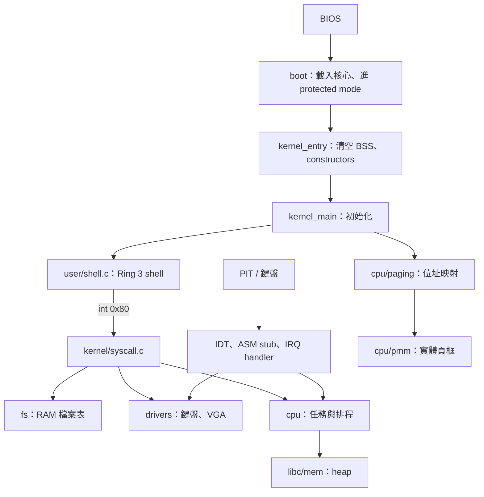

# 架構與開機流程

[回首頁](../README.md) · [概念對照](concepts.md) · [操作追蹤](traces.md)

這個 OS 的主線是：把磁碟上的機器碼放進 RAM，建立 CPU 執行環境，再讓 shell 透過系統呼叫使用核心服務。`user/` 與核心一起連結進同一個映像；目前沒有從檔案載入獨立可執行程式的 loader。

## 系統分層

圖中的箭頭表示啟動或主要呼叫關係。PMM 與 heap 是兩套配置器，現在的 heap 並不靠 PMM 動態取得頁框。

## 原始碼地圖

| 位置 | 負責什麼 | 先讀哪個符號 |
|---|---|---|
| [boot/](../boot/) | 開機、BIOS 讀碟、最初的 GDT | `load_kernel`、`switch_to_pm`、`_start` |
| [kernel/kernel.c](../kernel/kernel.c) | 子系統組裝與 shell 啟動 | `kernel_main` |
| [cpu/](../cpu/) | 中斷、特權、分頁、任務、I/O ports | `isr_install`、`init_paging`、`schedule` |
| [drivers/](../drivers/) | VGA、鍵盤、RTC | `kprint`、`keyboard_callback` |
| [libc/](../libc/) | 自製字串、輸出、heap、constructors、SSP | `kmalloc`、`call_global_constructors` |
| [fs/](../fs/) | 固定陣列中的檔案名稱、資料、大小 | `fs_file_t`、`fs_create` |
| [user/](../user/) | shell 與 hello 範例 | `user_shell_main` |
| 根目錄 `boot_sect_*.asm`、小型 C 範例 | 早期單項練習 | 不在目前 Makefile 的核心 C 來源清單中 |

## 從開機到 shell：照這個順序讀

1. [Makefile](../Makefile)：C 編成 `.o`，ASM 編成 ELF object；[linker.ld](../linker.ld) 把核心放在 `0x8000`。`kernel.bin` 是 raw binary；`kernel.elf` 保留符號供 GDB 使用。
2. [boot/bootsect.asm](../boot/bootsect.asm)：BIOS boot sector 入口以 `org 0x7c00` 定址，記住 `DL` 的開機裝置，呼叫 `load_kernel()`。
3. [boot/disk.asm](../boot/disk.asm)：從 CHS sector 2 起，一次讀一個 sector，總共 128 個（數量由 Makefile 傳給 NASM），放到 `0x8000`。BX 跨過 64 KiB 邊界時遞增 ES。使用 1.44 MB 軟碟的 18 sectors/track、2 heads 幾何。
4. [boot/switch_pm.asm](../boot/switch_pm.asm)：`cli → lgdt → CR0.PE=1 → far jump`，載入資料段，設定 `ESP=0x90000`，進入 `BEGIN_PM`，呼叫 `0x8000`。
5. [boot/kernel_entry.asm](../boot/kernel_entry.asm)：`_start → 清空 user／kernel BSS → call_global_constructors → kernel_main`。[libc/init.c](../libc/init.c) 掃描 linker 定義的 constructor 範圍。
6. [kernel/kernel.c](../kernel/kernel.c)：依序建立 ISR／IDT、PMM、heap、paging、IRQ、syscall、核心 GDT、TSS、任務系統、SimpleFS。
7. `task_create(shell_init_wrapper)` 建立 shell 任務，啟用 scheduler；原本的 task 0 進入 `hlt` 迴圈。
8. timer 排到 wrapper 後，`lauch_user_task(user_shell_main)` 由 PMM 配置一個完整 4 KiB user stack 頁，記入 PCB 並開放該頁 user 權限，透過 `iret` 進 Ring 3。`lauch` 是目前原始碼中的拼字。

核心 GDT 取代 boot GDT，增加 TSS 與 user segments；不要只讀 boot 的兩個 segments 就推論整個 OS 沒有 Ring 3。

## 記憶體位置速查

| 位址／範圍 | 目前用途 | 依據 |
|---|---|---|
| `0x7c00` | boot sector 定址 | `boot/bootsect.asm` |
| `0x8000` | 核心載入與連結起點 | boot sector、linker script |
| `align_up(__bss_end, 4096)` 到 `0x80000` | heap 可用範圍 | `libc/mem.c` |
| `0x90000` | 開機核心 stack 起始頂端；向低位址成長 | `boot/switch_pm.asm` |
| `0xb8000` | VGA 文字畫面 | `drivers/screen.h` |
| 低於 `0x100000` | PMM 保留，不再分配給頁框 | `kernel_main` |
| `0` 到 `0x7fffff` | 前 8 MiB identity mapping，預設 supervisor；只有 linker user 區段及使用中的 user stack 開放 | `init_paging` |
| `0xffc00000`／`0xfffff000` | supervisor-only recursive 頁表視窗／頁目錄位址 | `cpu/paging.h` |

PMM 假定總 RAM 為 128 MiB，沒有讀 BIOS memory map；「可管理 128 MiB 頁框」不等於「已映射 128 MiB」。SimpleFS 的資料陣列位於 `.bss`，因此也會推高 heap 起點。

## 三種大小不要混在一起

- boot sector：512 bytes，最後有 `0xaa55` 簽章。
- 核心磁碟內容：Makefile 要求 `kernel.bin ≤ 128 × 512 = 65536 bytes`；這個限制不代表整個核心執行期只占 64 KiB，`.bss` 另占 RAM。
- 整張映像：boot sector 加核心，再補到 1,474,560 bytes 的軟碟大小。

Makefile 的 `KERNEL_SECTORS` 同時用於映像大小檢查及 NASM boot sector 巨集；擴充時仍需檢查載入範圍。這條開機路線是自製 BIOS loader，沒有接入 Multiboot。

`linker.ld` 依 user object 分離 `.user_text`、`.user_rodata`、`.user_data` 與 `.user_bss`，邊界對齊 4 KiB。user 的 SSP 符號由 objcopy 改名，使用獨立的 guard／failure handler；核心 runtime 維持 supervisor。詳見[保護設計](user-protection.md)。
