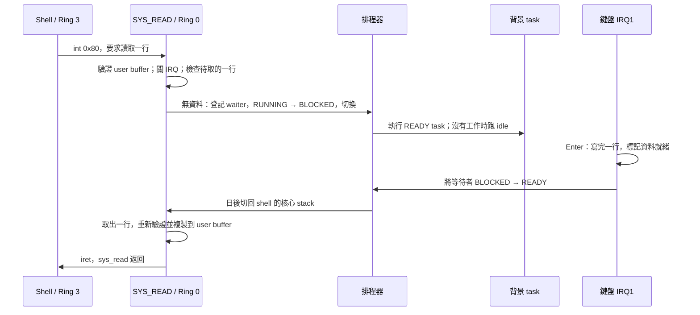

# 阻塞／喚醒與 Ring 3 搶佔實作計畫

狀態：已實作並通過 QEMU 驗收。更新日期：2026-10-01。本文保留 `04bc36c` 的實作前基線與任務順序，接續[上一階段的保護設計](user-protection.md)與[研究筆記](next-feature-research.md)；實際驗證證據見文末。

## 目標

讓等待鍵盤輸入的 shell **只暫停自己**，其他 task 繼續被排程；讓持續執行的 Ring 3 task 也能被 timer 中斷切換。核心仍以 `pcb_t` task 為排程單位，沿用單 CPU、共用 page directory、內建 user 程式與現有 `int 0x80` ABI。

目前測試可觀察到：shell 停在 `user@os>` 時背景 task 持續前進；按 Enter 後 shell 正常恢復；一個不主動 `yield`、不呼叫 syscall 的 Ring 3 迴圈也無法獨占 CPU。

## 實作前的流程基線

| 位置 | 實作前狀態 | 當時造成的效果 |
| --- | --- | --- |
| [shell](../user/shell.c) | `sys_read()` 以 `int 0x80` 進核心 | shell 等待期間仍停在同一次 syscall 的核心 stack 上 |
| [SYS_READ](../kernel/syscall.c) | 驗證 buffer 後呼叫 `scheduler_disable()`，以 `sti; hlt; cli` 等 `kbd_line_ready` | timer／鍵盤 IRQ 仍發生，但排程器全域停用 |
| [鍵盤 IRQ1](../drivers/keyboard.c) | Enter 複製一行到全域 buffer，設定 `kbd_line_ready` | 只有「資料已到」旗標，沒有喚醒特定 task |
| [PCB](../cpu/task.h)／[排程器](../cpu/scheduler.c) | 已有 `TASK_BLOCKED`，掃描時只選 `READY`／當前 `RUNNING` | 具備略過 blocked task 的基礎，但尚無完整 block／wake API |
| [timer IRQ0](../cpu/timer.c)／[排程器](../cpu/scheduler.c) | 每 tick 呼叫排程器；中斷來自 Ring 3 時直接返回 | Ring 3 計算迴圈沒有 timer 搶佔 |
| [切換與 TSS](../cpu/context_switch.asm)／[TSS](../cpu/tss.c) | 切換保存的 ESP，選定 task 後更新 `esp0` | 需要核對從 IRQ 返回至 Ring 3 時的完整 stack／暫存器路徑 |

概念上，IRQ 負責報告事件，`schedule()` 負責選下一個 task，`context_switch()` 負責換執行現場。`hlt` 只是讓目前 CPU 等下一個中斷；它本身不會把目前 task 變成 `BLOCKED`。

## 已實作的執行流程

另一條流程是 Ring 3 搶佔：IRQ0 在 task A 的核心 stack 上保存中斷現場；排程器保存 A 的 ESP，更新下一個 task 的 TSS `esp0`，切到 task B。日後切回 A，沿原本的 IRQ 返回路徑恢復現場並 `iret` 回 A 的 Ring 3 指令。IRQ0 的 EOI 必須在切換前送出；目前 [IRQ handler](../cpu/isr.c) 已在呼叫 timer callback 前送 EOI。

## 設計契約與不變條件

### 1. Task 狀態與排程

- 狀態轉換：`RUNNING → BLOCKED` 只由目前 task 在可安全切換的核心路徑執行；事件到達時 `BLOCKED → READY`；選中後 `READY → RUNNING`。`TERMINATED` 仍走既有的延後回收流程。
- 目前的鏈結串列可繼續保存所有存活 task，包含 `BLOCKED`；排程掃描要略過它們。`task_count` 表示存活數，不應誤當可執行數。PID 0 idle 永不阻塞，保證總有可切換目標。
- 提供明確的 `task_block_current(...)`／`task_wake(...)` 類型 API。呼叫者進入 block API 前須已保護事件狀態；API 返回時保留呼叫者原本的 IRQ 狀態。喚醒只改狀態，不在鍵盤 IRQ 內直接切換 stack。
- `scheduler_enabled` 只保留為開機啟動閘門；已移除 `scheduler_disable()`，`task_exit()` 也不再強制開啟 scheduler。

### 2. 鍵盤輸入與 `SYS_READ`

- 第一版 console 維持**一位讀者、一個待取的完整行**。`SYS_READ` 若遇到另一位讀者已登記，回傳 `SYS_EBUSY=-16`；已有完整行且未被另一讀者保留時立即取走，無須等待。
- Enter 先完成 buffer，再發布 ready 狀態，最後喚醒讀者。待取槽已滿時保留較早的一行，不覆寫它；新完成的一行依單槽容量策略捨棄並納入測試。未來若需要多讀者或連續輸入佇列，再另設 FIFO。
- `SYS_READ` 先驗證整個 user 輸出範圍；醒來後仍使用 `copy_to_user()` 重新檢查。等待期間其他 task 可能改變共用映射，不能把先前的驗證當成永久有效。讀取、清除 ready 狀態與 waiter 指標時要維持一致的 IRQ 保護規則。
- `SYS_READ` 的既有回傳語意、空行、最大 255 字元加 NUL、長度零與壞指標處理要保留；等待者結束或 PCB 重用後不可留下指向舊 PCB 的 waiter 指標。

### 3. 避免錯過喚醒

在單 CPU 條件下，將「檢查是否已有完整行 → 登記 waiter → 設為 `BLOCKED` → 呼叫排程器」放在同一個關 IRQ 的臨界區。如此 Enter 的 IRQ 只能在檢查之前完成，或在 waiter 已可被喚醒之後執行。切到另一個 task 時要恢復它自己的 IRQ 狀態；shell 日後返回 block API 時再恢復 shell 原來的狀態。

測試需涵蓋 Enter **早於** `SYS_READ`、shell **已阻塞後**才按 Enter，以及 IRQ 在檢查與切換邊界成為 pending 的情形。Linux 的 [wait queue 文件](https://docs.kernel.org/driver-api/basics.html)可作為「條件改變後喚醒、醒來重查條件」的參考；本專案實作自己的小型 API。

### 4. Ring 3 timer 搶佔

- 先逐欄核對 [IRQ stub](../cpu/interrupt.asm)、[`registers_t`](../cpu/isr.h)、[`context_switch()`](../cpu/context_switch.asm) 與 TSS `esp0`。CPL 3 進 IRQ 時 CPU 額外保存 user `SS:ESP`；CPL 0 進 IRQ 時 frame 形狀不同，不得在兩種路徑上誤讀 `esp/ss`。
- 保留每個 task 的獨立核心 stack。排程切換前保存當前 IRQ frame 所在的 stack，切換後更新下一個 task 的 `esp0`；恢復時由該 task 原本的 IRQ frame 與 `iret` 回到原 user 指令。必須驗證一般暫存器、segment selector、`EFLAGS` 和 user stack 都保持正確。
- IRQ0 可以在 user frame 上切換後，才移除 `scheduler_timer_handler()` 的 Ring 3 略過分支。仍沿用 50 Hz timer 與現有 Round-Robin；不以新增優先權演算法作為本階段前提。
- 核對 IRQ 與 syscall 路徑是否在修改排程佇列、鍵盤共享狀態或回收 stack 時保護臨界區；特別驗證連續 timer IRQ、鍵盤 IRQ 與 user syscall 交錯時沒有雙重喚醒或在舊 stack 上回收。

Intel 的 [IA-32 系統程式設計手冊 Volume 3A](https://www.intel.com/content/www/us/en/developer/articles/technical/intel-sdm.html)是核對中斷、特權切換、TSS 與 `iret` 硬體語意的依據；[Linux 核心的 IRQ 鎖定說明](https://docs.kernel.org/kernel-hacking/locking.html)可作為共享狀態競態的參考。兩者提供硬體／同步原則，本計畫的具體 API 與排程行為仍以本 repo 為準。

### 5. 將 `SYS_SLEEP` 接到同一機制

[`sleep()`／`sleep_ms()`](../cpu/timer.c) 已透過 `task_sleep_ticks()` 記錄 deadline 並阻塞呼叫者；timer 每 tick 掃描 PCB，期限到時改為 `READY`。`SYS_SLEEP` 維持秒數參數，零秒立即回 0，超過 `INT32_MAX / timer_freq` 的秒數回 `-1`（50 Hz 時上限為 42949672 秒）。相對 deadline 限制在 `2^31-1` tick 內，使用帶符號的 tick 差處理 32 位回繞。核心 `sleep_ms()` 對不足一 tick 的正數向上取整。

## 實作順序與可驗收任務

依賴關係：**任務 1 → 2 → 3 → 4 → 5 → 6**。每個任務以一次可建置、可驗證的修改為目標；任務 3 完成後先取得「shell 等待時背景工作仍前進」的成果，再進行風險較高的 Ring 3 timer 切換。

### 任務 1：建立排程專用的 QEMU 驗證入口

**內容：** 仿照現有 `PROTECTION_TEST`、QMP 鍵盤測試，新增獨立的 `SCHED_TEST` 映像與 debugcon 判定，不讓測試工作負載進入一般映像。先記錄現有 task 切換與 idle 可執行的基線。

**驗收：**

- [x] 測試映像能建立至少兩個 task，觀察各自前進並以 `isa-debug-exit` 明確回報 PASS／FAIL。
- [x] 一般映像的 shell 行為與既有 `make test` 維持通過。

**驗證：** `python3 tests/qemu_scheduling.py`、`make test`；檢查 `kernel.bin` 仍小於 Makefile 的 128 磁區上限。

**依賴：** 無。

**預計檔案：** `kernel/scheduling_test.c`、`kernel/kernel.c`、`tests/qemu_scheduling.py`、`Makefile`。**範圍：** 中。

### 任務 2：建立 task 阻塞與喚醒原語

**內容：** 補齊 `TASK_BLOCKED` 的生命週期、受 IRQ 保護的 block／wake API、idle 保底選擇，以及 PCB 回收時的等待狀態清理。維持現有 task linked list，避免同時重寫佇列架構。

**驗收：**

- [x] A 阻塞後 B 與 idle 可繼續執行；B 喚醒 A 後，A 從原本呼叫位置繼續。
- [x] 重複阻塞／喚醒、重複喚醒與 task 結束／PCB 重用不造成錯誤狀態或 stale 指標。
- [x] 沒有 `READY` 工作時 idle 仍可接受 timer／鍵盤中斷。

**驗證：** 在 `SCHED_TEST` 中做確定性的狀態轉換測試，執行 `python3 tests/qemu_scheduling.py` 與 `make test`。

**依賴：** 任務 1。

**預計檔案：** `cpu/task.h`、`cpu/task.c`、`cpu/scheduler.h`、`cpu/scheduler.c`、`kernel/scheduling_test.c`。**範圍：** 中。

### 任務 3：讓 `SYS_READ` 只阻塞 shell

**內容：** 鍵盤 IRQ 發布完整行並喚醒已登記讀者；`SYS_READ` 在受保護的檢查後阻塞自己，醒來才取行並複製到 user buffer。移除這條等待路徑上的全域 `scheduler_disable()`。

**驗收：**

- [x] shell 等輸入期間，背景 task 的計數隨多個 timer tick 持續增加；按 Enter 後 shell 收到正確內容。
- [x] Enter 早到、空行、重複讀、第二讀者與槽已滿時都符合前述契約；檢查／阻塞邊界不會遺失喚醒。
- [x] 壞 user buffer 仍先回錯誤，醒來後複製失敗也安全返回；既有 shell 指令測試通過。

**驗證：** QMP 注入真實鍵盤 IRQ，執行 `python3 tests/qemu_scheduling.py`、`python3 tests/qemu_shell.py`、`make test`。

**依賴：** 任務 2。

**預計檔案：** `drivers/keyboard.c`、`drivers/keyboard.h`、`kernel/syscall.c`、`kernel/syscall.h`、`tests/qemu_scheduling.py`。**範圍：** 中。

### 檢查點 A：鍵盤等待完成

- [x] shell 等待時全域 scheduler 保持啟用。
- [x] 喚醒發生在資料發布之後；沒有等待者時，已完成的一行仍可被下次 `SYS_READ` 取得。
- [x] `make test`、排程專用 QEMU 測試皆通過。

### 任務 4：讓 timer 搶佔 Ring 3 task

**內容：** 以兩個不主動讓出 CPU 的 user task 驗證 IRQ frame、TSS 與 stack 往返，再開放 `scheduler_timer_handler()` 對 Ring 3 frame 執行切換。保留 IRQ0 EOI 時序與目前的延後回收順序。

**驗收：**

- [x] 兩個無 `yield`／syscall 的 Ring 3 計算迴圈在有限 tick 內都增加計數。
- [x] 多次 user ↔ user、user ↔ idle 切換後，PID、一般暫存器、user stack、`EFLAGS`、syscall 返回與 TSS `esp0` 均正確；無 fault／panic。
- [x] 背景計算迴圈運作時，shell 仍能在 Enter 後恢復；原保護測試仍通過。

**驗證：** `python3 tests/qemu_scheduling.py` 的搶佔情境、`make test`；以 debugcon 的 tick／task 進度確認 timer IRQ 持續運作。

**依賴：** 任務 3。

**預計檔案：** `cpu/scheduler.c`、視 frame 核對結果調整的 `cpu/interrupt.asm`、`kernel/scheduling_test.c`、`user/scheduling_test.c`、`tests/qemu_scheduling.py`；同時審閱 `cpu/context_switch.asm` 與 `cpu/tss.c`。**範圍：** 中。

### 檢查點 B：Ring 3 搶佔完成

- [x] 測試能證明 user 計算迴圈無需合作也會讓出 CPU。
- [x] shell 鍵盤流程、90 次 user fault 回收與 kernel panic 測試仍通過。
- [x] 核對 Ring 0／Ring 3 IRQ frame 與 TSS 更新的實際執行路徑。

### 任務 5：讓 `SYS_SLEEP` 真正睡眠

**內容：** 重用 block／wake API，以 tick deadline 喚醒睡眠 task；處理 tick 回繞與輸入上限，替換現有 `hlt` 等待迴圈。

**驗收：**

- [x] A 睡眠時 B 持續前進；期限到後 A 返回 syscall，零秒立即返回。
- [x] 兩個不同期限的睡眠 task 按預期時間醒來，跨 tick 回繞也不會提前或永久不醒。
- [x] idle 與其他 `READY` task 不被某一個睡眠 task 阻塞。

**驗證：** 在 `SCHED_TEST` 增加 tick 控制／觀察情境，執行 `python3 tests/qemu_scheduling.py` 與 `make test`。

**依賴：** 任務 4。

**預計檔案：** `cpu/timer.c`、`cpu/timer.h`、`cpu/task.h`、`cpu/task.c`、`kernel/scheduling_test.c`。**範圍：** 中。

### 任務 6：文件、整體回歸與交付

**內容：** 更新首頁與概念／流程／保護文件，使實作限制、狀態圖、syscall 回傳契約和測試說明與程式一致；回填本計畫的完成狀態。

**驗收：**

- [x] 文件能從 shell `sys_read` 追到鍵盤 IRQ、block／wake、timer 搶佔與 `iret`。
- [x] 每個驗收情境在 QEMU 中有可重跑證據，普通映像無測試注入行為。
- [x] `make test`、`git diff --check` 通過，映像大小仍符合 boot loader 載入上限。

**驗證：** 完整 `make test`、閱讀更新後連結與 QEMU debugcon 輸出。

**依賴：** 任務 5。

**預計檔案：** `README.md`、`docs/concepts.md`、`docs/traces.md`、`docs/user-protection.md`、本文件。**範圍：** 中。

## 需要特別觀察的風險

| 風險 | 可觀察症狀 | 對應檢查 |
| --- | --- | --- |
| Enter 落在檢查與 block 之間 | buffer 已 ready，shell 卻永久睡眠 | 關 IRQ 的原子交接；早到／邊界注入測試 |
| waiter 指向已回收的 PCB | 重建 task 後喚醒錯誤 PID 或改壞佇列 | 結束與重用循環，清除 waiter 後才允許回收 |
| 中斷 frame 或 TSS `esp0` 不對 | `iret` fault、user stack 損壞、PID 混亂 | 無 syscall 迴圈、暫存器哨兵、user↔user 切換測試 |
| 持有 IRQ 關閉狀態太久 | timer 停止、鍵盤無反應 | 臨界區只包狀態操作；每個 task 使用自己的 flags 保存／恢復 |
| 輸入行與 user buffer 在等待期間改變 | 指令遺失或 kernel fault | IRQ 保護完成行；醒後再 `copy_to_user()`；保留壞指標測試 |
| 測試程式撐大核心映像 | `kernel.bin` 超出 65536 bytes | 測試專用巨集與每階段映像大小檢查 |

## 完成定義

本計畫完成的核心證據是同一輪 QEMU 驗證中同時看到：shell 等待期間背景計數前進、Enter 喚醒 shell、兩個純 Ring 3 計算迴圈都被 timer 輪流執行、睡眠 task 到期恢復、既有保護與 shell 回歸測試全數通過。每個任務完成時更新上面的核取方塊與實際驗證指令／結果。

## 實際驗證證據

2026-10-01 執行 `python3 tests/qemu_scheduling.py`、完整 `make test` 與 `git diff --check`。排程測試使用獨立 `SCHED_TEST` 映像，QMP 注入鍵盤 IRQ，最後由 `isa-debug-exit` 回傳 33 並輸出 `SCHED TESTS PASS`。一般映像的 `kernel.bin` 為 36864 bytes，低於 65536-byte 載入上限；測試映像也經相同大小閘門。

| 任務 | 可重跑的具體檢查 |
| --- | --- |
| 1、2 | 兩個 kernel task 各完成 20 次進度；3 輪 block／wake 從原呼叫處返回，重複 wake 不改壞狀態，block 返回保留關 IRQ 狀態；等待讀者被喚醒後退出，舊 PCB slot 由一般 task 重用，再確認不同 slot 的新讀者可正常等待，避免 stale waiter 被同址重用掩蓋 |
| 3 | QMP 測 blocked 後 Enter、Enter 早到、空行、第二讀者 `-16`、兩次 Enter 的單槽保留；在關 IRQ 的檢查／block 交界等待 PS/2 資料 ready，確保 Enter 已 pending 才切換；user buffer 頁權限在等待期間撤銷，醒後 `SYS_READ` 回 `-14` |
| 4 | 兩個無合作 Ring 3 迴圈在 4 個各 8 tick 的視窗中都持續前進；記錄至少 4 次 user→user、user→idle、idle→user 切換；逐次核對 TSS `esp0`、IRQ frame 所屬 kernel stack、user SS／ESP；迴圈檢查 EBX、ESP、DS=0x2b、ES／FS／GS=0、EFLAGS IF／DF，結束前以 `GETPID` 驗證 PID 與 syscall 返回後的 selector |
| 5 | 3-tick／7-tick 睡眠跨回繞，依順序返回且延遲分別限於 3–5／7–9 tick；背景 task 前進；user `SYS_SLEEP(1)` 到期返回，零秒及超大秒數回傳契約成立 |
| 3、4、6 | 真實 shell 等鍵盤期間背景計數持續增加，另有純 Ring 3 計算迴圈並行；`echo scheduling` 正常返回提示字元，`exit` 正常回收；既有 shell 指令、90 次 user fault、kernel panic 與 layout 測試通過 |

IRQ／exception／syscall stub 已改為分別保存並恢復 DS／ES／FS／GS；ES／FS／GS 私有保存欄位放在 `registers_t.ds` 下方，傳入 C 的 frame 欄位位置維持不變。`cpu/context_switch.asm` 與 `cpu/tss.c` 的切換路徑可沿用；正式映像不含上述 pending IRQ、退出或映射撤權注入。仍沿用單 CPU、共享 user address space、單讀者／單槽 console 與 Round-Robin，尚無一般化 wait queue、優先權或不同 user 任務的隔離。
