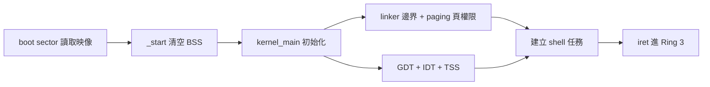
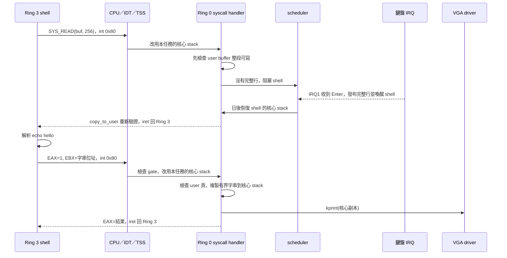
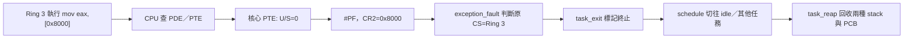

# 從 Ring 3 shell 看懂保護、syscall 與排程

[回首頁](../README.md) · [保護設計與驗證](user-protection.md) · [手動練習](practice.md)

這份導覽沿著兩件事讀程式：shell 執行 `echo hello`，以及你在 GDB 讓 Ring 3 讀取核心位址 `0x8000`。前者說明 user 程式如何合法使用核心；後者說明越權時 CPU 和核心各做什麼。

## 先分清三種「切換」

| 概念 | 這個 OS 的實作 | 會改變什麼 |
| --- | --- | --- |
| 權限切換 | GDT 的 user/kernel selector、`int 0x80`、`iret`、TSS | CPU 在 Ring 3 與 Ring 0 之間進出；同一個任務可以跨 Ring 執行 |
| 位址存取檢查 | page directory／page table 的 U/S、R/W 位元 | CPU 判斷目前權限是否能讀、寫或取得該頁上的指令 |
| 任務切換 | PCB、scheduler、`context_switch` | 換成另一個任務的執行現場與核心 stack；PID 可以改變 |

`CS=0x23` 的最低兩位為 3，表示目前在 Ring 3。這只回答「誰在執行」；能不能存取某個位址，仍要看頁表。核心收到 syscall 時改在 Ring 0 執行，但仍是同一個 shell 任務，不會因為一次 `int 0x80` 自動換 PID。[Intel 系統程式設計手冊](https://cdrdv2-public.intel.com/825758/253668-sdm-vol-3a.pdf)說明 CS 的 CPL、頁表的 U/S／R/W 及特權切換規則。

## 開機時，誰把保護邊界建立起來？



1. [boot/bootsect.asm](../boot/bootsect.asm) 將核心映像載到 `0x8000`；[linker.ld](../linker.ld) 必須以同一位置安排程式碼，並把 `user/*.o` 的 text、rodata、data、BSS 分在各自對齊 4 KiB 的區段。如此才能給不同區段不同頁權限。
2. [boot/kernel_entry.asm](../boot/kernel_entry.asm) 先清空 BSS，再呼叫 constructors 和 [kernel_main()](../kernel/kernel.c)。`kernel_main()` 初始化實體頁框配置器、核心 heap、paging、中斷、GDT、TSS、任務與 RAM 檔案系統。
3. [init_paging()](../cpu/paging.c) 把前 8 MiB 建成 identity mapping（虛擬位址等於實體位址）。PTE 預設是 supervisor；user text／rodata 改成 user 可讀、不可寫，user data／BSS 改成 user 可讀寫。核心、頁表及其 recursive mapping 仍為 supervisor。
4. 核心用 [task_create()](../cpu/task.c) 建立 shell 的 PCB 與 8 KiB 核心 stack。排到該任務時，[lauch_user_task()](../cpu/usermode.c) 從 PMM 取得一整頁 4 KiB 的 user stack，開放該頁的 user 權限，再以 `iret` 進入 `user_shell_main()`。

這裡有兩種配置器：`kmalloc` 從核心 heap 分出可變大小區塊，供 PCB 任務的**核心 stack**使用；`pmm_alloc_frame` 給出完整且頁對齊的實體 frame，供**user stack**使用。只有完整獨立的頁，才能安全地將該頁標成 user 可用。

注意 PDE 與 PTE 要一起看：user 存取要經過兩層權限檢查，兩層都允許才行。本專案前 8 MiB 的兩個 PDE 設為可供 user 存取，但核心位址 `0x8000` 對應的 **PTE** 仍清除 U/S，所以 Ring 3 讀它會被擋下。`CR0.WP` 另外讓核心寫入唯讀 user text 時也會觸發 fault。真正的區段位置以 linker 符號為準，`user_shell_main` 的數值可能隨編譯而變。

## 合法路徑：`echo hello` 如何印到畫面？



shell 先經 `SYS_READ` 取得你輸入的一行。[鍵盤驅動](../drivers/keyboard.c)收到 IRQ1 與 Enter 後，核心把該行複製回 shell buffer；shell 解析出 `echo` 與 `hello`。接著 [sys_write()](../user/shell.c) 將 syscall 編號 `1` 放在 EAX，字串位址放在 EBX，再執行 `int 0x80`。[idt.c](../cpu/idt.c) 只讓 `0x80` gate 的 DPL 為 3；一般 gate 是 DPL 0。CPU 進 Ring 0 時，以 TSS 的 `ss0:esp0` 改用**這個任務的核心 stack**。[syscall.asm](../cpu/syscall.asm) 保存暫存器，並把保存的 frame 交給 [syscall_handler()](../kernel/syscall.c)。

handler 不能直接把 EBX 當成可信的核心指標：user 可以故意填 `0x8000`，讓核心替它讀取核心資料。因此 `SYS_WRITE` 先呼叫 [copy_string_from_user()](../cpu/usercopy.c)，逐位址檢查、限制長度，複製到核心暫存區，才交給 `kprint`。檔案 syscall 的檔名與資料 buffer 也走同一個邊界；輸出 buffer 另外要檢查可寫。無效範圍回傳 `-14`，不應讓核心自己在解參考指標時 page fault。

`SYS_READ` 的路徑相反：先確認 shell buffer 的**整段容量**都可寫；沒有完整行時只阻塞 shell，其他 task 照常排程。鍵盤完成輸入後喚醒 shell，`copy_to_user` 在複製時重新檢查 user 映射。詳見[阻塞與搶佔實作](blocking-wakeup-preemption-plan.md)。

## 非法路徑：Ring 3 讀 `0x8000` 時發生什麼？

你在 GDB 看到的 `CS=0x23`，確認停在 Ring 3。GDB 把 `a1 00 80 00 00` 放到 user stack，這五個位元組是 `mov eax, [0x8000]`。目前沒有 NX，user stack 可以執行指令，因此能用它做這個實驗。GDB 寫入測試指令本身並未驗證保護；最後的 `continue` 才讓 **CPU 以 Ring 3 身分執行讀取**。

從專案根目錄重做實驗：先執行 `make os-image.bin kernel.elf`。終端 A 啟動 QEMU：

```sh
qemu-system-i386 -m 128 -S -s \
  -drive file=os-image.bin,format=raw,if=floppy \
  -display gtk,gl=off
```

終端 B 執行 `gdb kernel.elf`，再輸入：

```gdb
set architecture i386
target remote localhost:1234
hbreak user_shell_main
continue
p/x $cs
set {unsigned int}($esp - 0x100) = 0x008000a1
set {unsigned char}($esp - 0xfc) = 0x00
x/5xb $esp - 0x100
set $eip = $esp - 0x100
continue
```

最後一次 `continue` 後，QEMU 畫面應印出 `USER FAULT ... cr2=0x8000 error=0x5`；GDB 沒有立刻回到提示字元是正常的，因為 CPU 已在繼續執行。



CPU 找到該頁存在，但 PTE 不允許 user 存取，於是產生 #PF。`CR2=0x8000` 是造成 fault 的位址；你看到的 `error=0x5` 可拆成 `P=1`（頁存在但權限不符）、`W/R=0`（讀取）、`U/S=1`（user 存取）。CPU 經 IDT 的例外入口轉入核心；[exception_fault()](../cpu/isr.c) 查看保存的原 CS，記錄 PID、EIP、CR2、error code。本例的 user #PF 會呼叫 `task_exit()`；核心 fault，以及 NMI、double fault、machine check 等嚴重例外則 panic。這些錯誤碼位元的定義可對照 [Intel 系統程式設計手冊](https://cdrdv2-public.intel.com/825758/253668-sdm-vol-3a.pdf)。

為什麼不能在 `task_exit()` 裡立刻 `kfree` 自己的核心 stack？當前函式和例外處理仍在**那塊 stack 上執行**。本實作先標記任務終止，[schedule()](../cpu/scheduler.c) 選下一個存活任務、把死任務移出鏈結串列、更新 TSS 的下一個核心 stack，並用 `context_switch` 換 stack。換到另一個任務後，[task_reap()](../cpu/task.c) 才撤銷 user stack 的頁權限、清零並釋放 frame、釋放核心 stack、清空 PCB 供下次重用。

正常映像只有 shell 與 PID 0 idle；shell 故障後不會自動重開 shell，但 timer 和 idle 可繼續執行。[保護測試](../tests/qemu_protection.py)另外建立第二個 user 任務，驗證故障任務結束後它仍能前進，且反覆建立／終止超過 32 次後 PCB 能重用。

## 用四個問題檢查是否連起來了

1. **`CS=0x23` 為什麼還不足以證明核心受到保護？** 它只表明目前 CPL=3；仍要檢查核心 PTE 的 U/S 是否為 0，以及 syscall 是否拒絕替 user 讀寫核心位址。
2. **為什麼 `int 0x80` 能進核心，而 `int 0x20` 不行？** `0x80` gate 的 DPL=3；一般 gate 的 DPL=0。Ring 3 主動執行後者會得到 #GP。硬體 IRQ 不受這項軟體 `INT` 呼叫限制。
3. **為什麼 syscall 要換 stack，卻不一定換任務？** CPU 用 TSS 換到同一任務的核心 stack 以安全執行 handler；若要換任務，scheduler 先選下一個 PCB，再由 `context_switch` 切換執行現場。
4. **為什麼頁表擋得住直接讀核心，仍需 `copy_from_user`？** syscall 已經在 Ring 0；若它盲目信任 EBX 指標，核心就可能代 user 存取受保護的資料。檢查每一頁後才複製，才能守住入口。

想自己重走流程，可先在 [kernel_main()](../kernel/kernel.c) 看初始化順序，再順著 [user/shell.c](../user/shell.c) → [cpu/syscall.asm](../cpu/syscall.asm) → [kernel/syscall.c](../kernel/syscall.c) 讀合法路徑，最後順著 [cpu/paging.c](../cpu/paging.c) → [cpu/isr.c](../cpu/isr.c) → [cpu/task.c](../cpu/task.c) → [cpu/scheduler.c](../cpu/scheduler.c) 讀故障路徑。完整測試契約與限制列在[保護設計與驗證](user-protection.md)。
