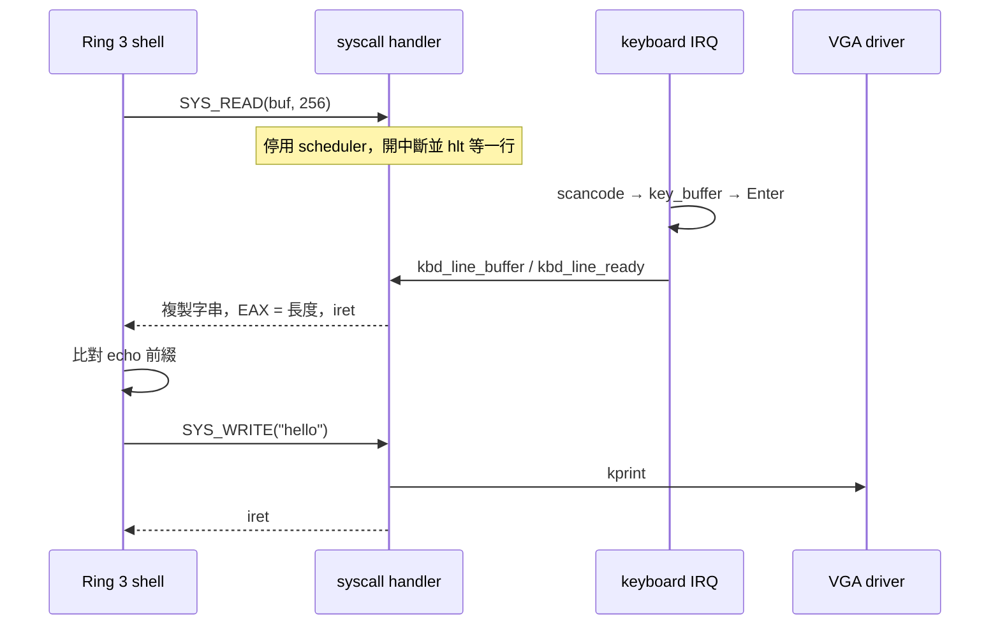

# 從 shell 追到硬體與核心

[回首頁](../README.md) · [概念](concepts.md) · [練習](practice.md)

用一次操作當作線索，可以把分散的檔案串成可記憶的流程。以下是依原始碼追蹤的路徑；操作驗證方式見練習頁。

## 路線 A：輸入 `echo hello`



1. [user/shell.c](../user/shell.c) 的 `sys_read` 設定 EAX=2、EBX=buffer、ECX=長度，執行 `int 0x80`。
2. CPU 經 IDT 進核心，跨權限時使用 TSS 的核心 stack。[cpu/syscall.asm](../cpu/syscall.asm) 保存暫存器，把 frame 指標交給 `syscall_handler`。
3. [kernel/syscall.c](../kernel/syscall.c) 的 `SYS_READ` 先檢查整個輸出範圍可寫，再等待 `kbd_line_ready`。開中斷讓 IRQ 能進來，`hlt` 暫停 CPU 直到事件發生。
4. [drivers/keyboard.c](../drivers/keyboard.c) 的 callback 處理輸入；Enter 把 `key_buffer` 複製到 `kbd_line_buffer` 並設定 ready。
5. handler 透過核心暫存區與 `copy_to_user` 複製到 user buffer，設定 `r->eax` 為長度。stub 的 `popa` 恢復這個修改過的 EAX，`iret` 返回 shell。
6. shell 比對 `echo `，將後面的字串經 `SYS_WRITE` 有界複製到核心後交給 `kprint`；[drivers/screen.c](../drivers/screen.c) 寫 VGA。

鍵盤驅動處理的是輸入編輯，shell 才負責命令語意。history 和 Tab 在 driver，這也解釋了為什麼補全清單可能落後於 shell 命令。

## 路線 B：`write note hello`，再 `cat note`

```text
user_shell_main
  → split_once：拆成 note 與 hello
  → SYS_FS_CREATE(7)：嘗試建立 note
  → SYS_FS_WRITE(10)：name / data / len 放入 EBX / ECX / EDX
  → syscall_handler：有界複製 name，驗證完整 data 範圍，copy_from_user
  → fs_write：找檔案，複製資料，更新 size

cat note
  → SYS_FS_READ(9)
  → syscall_handler：有界複製 name，驗證完整輸出 buffer 可寫
  → fs_read：從 file_table 複製到核心暫存 buffer
  → copy_to_user：複製實際讀到的 bytes 至 shell buffer
  → shell 加上 NUL
  → SYS_WRITE(1)
  → kprint → VGA
```

對照 [user/shell.c](../user/shell.c)、[kernel/syscall.h](../kernel/syscall.h)、[fs/fs.c](../fs/fs.c)。已有同名檔案時，shell 仍會繼續 write，因此內容會被覆蓋。核心每檔支援 4096 bytes，但 shell 的 `cat` 目前只讀最多 511 bytes；不要把 shell buffer 上限誤認為檔案系統容量。

## 路線 C：第一次從 idle 排到 shell

```text
PIT IRQ0（設定為 50 Hz）
  → cpu/interrupt.asm：irq0 → irq_common_stub
  → cpu/isr.c：irq_handler（先送 EOI）
  → cpu/timer.c：timer_callback（tick++）
  → cpu/scheduler.c：scheduler_timer_handler → schedule
  → 更新任務狀態、current_task、TSS.esp0
  → cpu/context_switch.asm：保存舊 ESP，載入新 ESP，ret
  → cpu/task.c：task_start（回收、開中斷、呼叫 entry）
  → kernel/kernel.c：shell_init_wrapper
  → cpu/usermode.c：lauch_user_task → enter_usermode
  → iret → user_shell_main
```

可從 [scheduler.c](../cpu/scheduler.c) 開始逆向追。此路線起點是 Ring 0 的 idle，因此通過 `regs->cs` 檢查；若 timer 中斷的是 Ring 3，該 handler 會直接返回，不會執行這次切換。

## Syscall 速查

以 [kernel/syscall.h](../kernel/syscall.h) 與 [syscall_handler](../kernel/syscall.c) 為準，EAX 放編號，結果也由 EAX 回傳。

| EAX | 名稱 | EBX / ECX / EDX | 目前用途 |
|---|---|---|---|
| 0 | EXIT | code / — / — | 結束任務；code 目前未使用 |
| 1 | WRITE | NUL 字串 / — / — | 畫面輸出，成功回 0 |
| 2 | READ | buffer / 容量 / — | 讀一行，回傳字串長度 |
| 3 | SLEEP | 秒數 / — / — | timer 等待；shell 無此命令 |
| 4 | GETPID | — | 取得任務 PID |
| 5 | CLEAR | — | 清畫面 |
| 6 | YIELD | — | 主動呼叫 schedule；shell 無此命令 |
| 7 | FS_CREATE | 名稱 / — / — | 建立檔案 |
| 8 | FS_LIST | — | 核心直接列印檔案清單 |
| 9 | FS_READ | 名稱 / buffer / 容量 | 回傳 bytes 數或負錯誤碼 |
| 10 | FS_WRITE | 名稱 / 資料 / 長度 | 覆蓋內容，成功回 0 |
| 11 | FS_DELETE | 名稱 / — / — | 刪除檔案 |

所有指標參數都經 [cpu/usercopy.c](../cpu/usercopy.c) 驗證；無效範圍回傳 `-14`，字串超過上限仍無 NUL 回傳 `-36`。`SYS_WRITE` 上限 1024 bytes（含 NUL），檔名上限 32 bytes（含 NUL）。buffer 長度使用 uint32_t；零長度 FS buffer 不被存取，`SYS_READ` 的零容量則回傳 `-1`。詳見[ABI 與驗證契約](user-protection.md#syscall-契約)。
